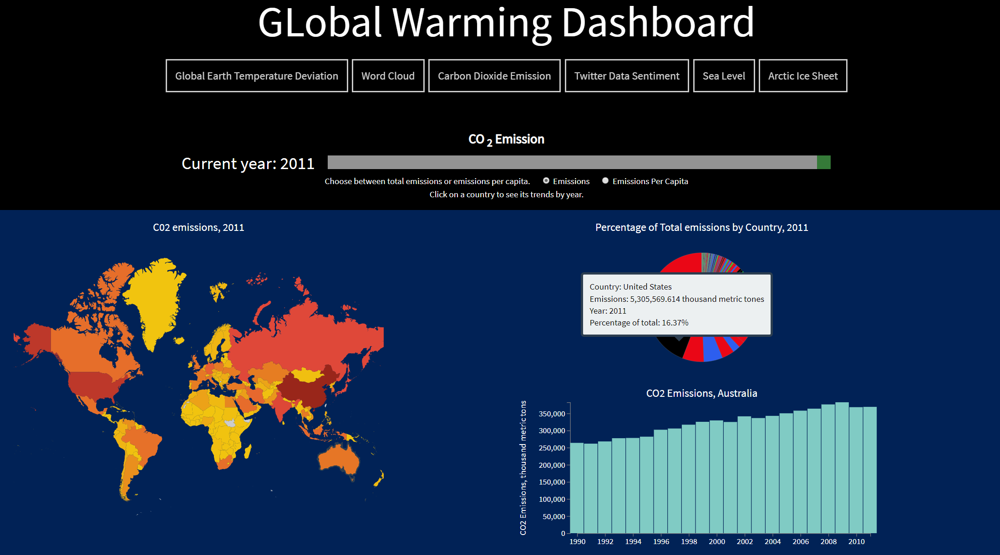
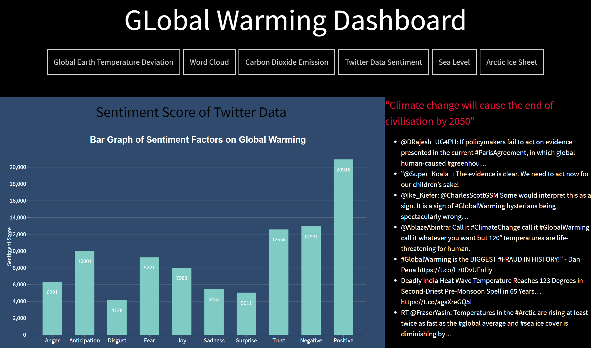
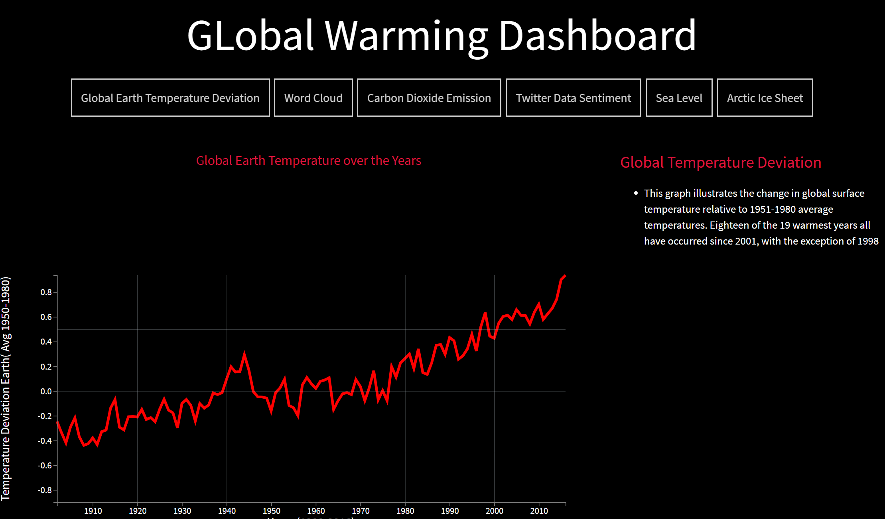
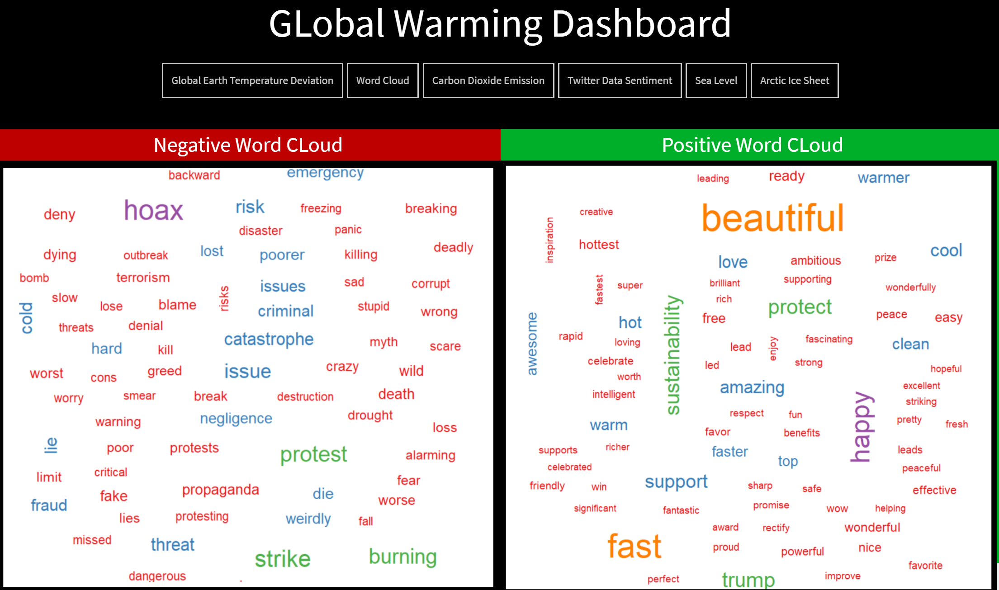

## Interactive Dashboard which provides the evidence that Global Warming is Happening.

Details of the Dasboard :
1. The website has been designed using D3 , HTML and CSS for the responsiveness and styling
2. The key factors analysed in the dashboard are :
  * Carbon-Dioxide emitted by countries over the years.
  * Sentiment Analysis of the Twitter-Data of about 50K public Tweets about Global Warming.
  * Earth temperature deviation over the years.
  * Sea-Level rise over the rise.
  * Arctic Ice area over the years.
3. Using R-programming and twitter developer API the data for the sentiment analysis has been collected.
4. Using NRC sentiment library the data is being analysed and the positive and negative word cloud is made using Wordcloud library. 
 

How to run the dashboard:
1. Open the file Earth.html using **bracket** or Visual studio code editor.
2. Launch the file using the code editor.

 

Image's of the interactive dashboard.

1. **Carbon-Dioxide Sheet shpwing emission for each country over the years from 1990-2014.**

 
2. **Twitter Sentiment Analyses showing different emotions of people about Global Warming and top 10 tweets.**

 
3. **Earth temperature over the years.**

 
4. **Frequent positive and negative words used by the people to express about Global Warming**.

